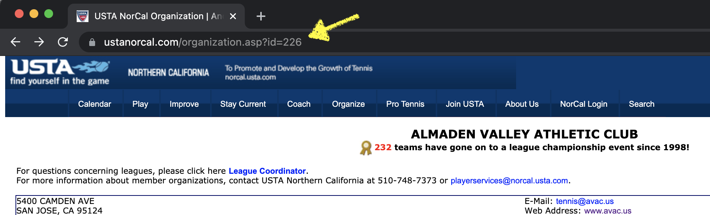

## USTA NorCal Club Newsletter

This project provides a CLI tool to generate a newsletter for a tennis club participating in a USTA Norcal League. The newsletter consists of recent past results and upcoming fixtures.

## Installation

1. Download the latest release from https://github.com/ycombinator/usta-norcal-club-newsletter/releases.

2. Extract the release.

3. Locate your platform's folder.
   ```
   cd $RELEASE_DIR/dist/$YOUR_PLATFORM
   ```

4. Run the executable.
   ```
   ./usta-norcal-club-newsletter [<ORG_ID>]
   ```

   The `ORG_ID` argument is optional. The default `ORG_ID` is 226, which is the 
   Organization ID for Almaden Valley Athletic Club.

   

## Development

1. Download and install [Go](https://golang.org/).

2. Install project dependencies.
   ```
   cd usta-norcal-club-newsletter
   go get
   ```

4. Run the tool.
   ```
   go run main.go [<ORG_ID>]
   ```
   
