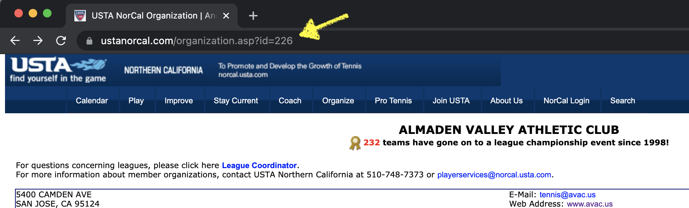

## USTA NorCal Club Newsletter

This project provides a browser app and CLI tool to generate a newsletter for a tennis club participating in a USTA NorCal League. The newsletter consists of recent past results and upcoming fixtures.

## Web app

The static web app in [`web/`](web/) loads an organization's public schedule through the Net Results API, lets an organizer correct results and fixtures in the browser, and exports recent and upcoming match boards as JPEG images. Draft data and settings stay in the browser's local storage; the site has no server-side component of its own.

Run it locally with:

```sh
cd web
npm install
npm run dev
```

The Pages workflow deploys the app at `https://ycombinator.github.io/usta-norcal-club-newsletter/`. Before the first deployment:

1. Enable GitHub Pages with **GitHub Actions** as the source in the repository settings.
2. Deploy the companion Net Results API change, which provides `GET /organizations/{id}/schedule` and permits the Pages origin on that one public endpoint.

Use `VITE_NET_RESULTS_API_URL` to point a local or custom build at another API deployment.

## Installation

1. Download the latest release from https://github.com/ycombinator/usta-norcal-club-newsletter/releases.

2. Extract (unzip or untar) the release.

3. Locate your platform's folder.
   ```
   cd $RELEASE_DIR/dist/$YOUR_OS/$YOUR_ARCH
   ```

   For example, if you've downloaded the 0.1.0 release and are on a 2019 Macbook Pro:
   ```
   cd usta-norcal-club-newsletter-0.1.0/dist/darwin/amd64
   ```

4. Run the executable.
   ```
   ./usta-norcal-club-newsletter [flags]
   ```

   **Flags:**
   | Flag | Default | Description |
   |------|---------|-------------|
   | `-org` | `225` | USTA NorCal organization ID |
   | `-teams` | | Comma-separated list of additional team IDs to track |
   | `-format` | `jpeg` | Output format for both sections: `console`, `pdf`, `jpeg`, or `html` |
   | `-recent-format` | | Output format for recent results (overrides `-format`) |
   | `-upcoming-format` | | Output format for upcoming matches (overrides `-format`); also accepts `gcal` |
   | `-past` | `7` | Number of days back to include past match results |
   | `-future` | `14` | Number of days ahead to include upcoming matches |
   | `-outdir` | | Output directory for file-based formatters (default: `~/Documents/ASRC/YYYY/YYYYMMDD`) |
   | `-boundary-date` | | Date (YYYY-MM-DD) dividing recent and upcoming matches (default: tomorrow) |

   **Examples:**
   ```
   ./usta-norcal-club-newsletter                         # Default org, JPEG output
   ./usta-norcal-club-newsletter -org=300                # Specify a different organization
   ./usta-norcal-club-newsletter -teams=123,456          # Track additional teams by ID
   ./usta-norcal-club-newsletter -format=pdf             # Generate PDF newsletter
   ./usta-norcal-club-newsletter help                    # Show help message
   ```

   

## Intermediate data files

Every time the tool runs and generates output, it also saves an intermediate data file (`data.json`) in the same output directory as the report images. This file is a human-readable JSON snapshot of everything in the report.

**Example output directory after a run:**
```
~/Documents/ASRC/2026/20260628/
  asrc_usta_2026_06_28_recent.jpg
  asrc_usta_2026_06_28_upcoming.jpg
  data.json
```

### Correcting errors without re-fetching from USTA

If USTA's website has an incorrect date, wrong score, or missing outcome, you can fix it directly in `data.json` and regenerate the report without touching USTA's servers:

1. Open `data.json` in a text editor.
2. Find the match entry to correct. Each entry looks like:
   ```json
   {
     "date": "2026-06-27",
     "gender_emoji": "👫",
     "level": "4.5",
     "is_home": true,
     "opponent": "Courtside",
     "is_win": true,
     "outcome_text": "won 3-2",
     "match_type": "playoff"
   }
   ```
3. Edit the field(s) you want to correct — for example, change `"date": "2026-06-27"` to `"date": "2026-06-26"` to move a match to the correct day.
4. Re-run the tool with the same flags (including `-boundary-date` if you used it). Because `data.json` already exists, the tool loads it instead of fetching from USTA, prompts are skipped, and the report images are regenerated.
   ```
   ./usta-norcal-club-newsletter -boundary-date 2026-06-28
   ```

**Editable fields in `past_matches`:**

| Field | Description |
|-------|-------------|
| `date` | Match date in `YYYY-MM-DD` format. Change to fix a wrong date — the match will be sorted and grouped correctly. |
| `opponent` | Opponent display name. |
| `is_win` | `true` if we won. |
| `is_rained_out` | `true` if the match was rained out. |
| `is_incomplete` | `true` if the match result is not yet final. |
| `outcome_text` | Score string, e.g. `"won 3-2"` or a partial score like `"2-0"`. |
| `footnote` | Explanation shown as a footnote, e.g. `"to be completed later"`. |
| `match_type` | `"regular"`, `"playoff"`, or `"sectionals"`. |

**Editable fields in `future_matches`:**

| Field | Description |
|-------|-------------|
| `date` | Match date in `YYYY-MM-DD` format. |
| `time` | Match time in `HH:MM` 24-hour format, e.g. `"18:00"`. |
| `opponent` | Opponent display name. |
| `is_home` | `true` if playing at home. |
| `location_note` | Alternate venue name shown as a footnote for extra-team matches. |

> **Note:** Google Calendar sync (`-upcoming-format=gcal`) always requires live USTA data and will be skipped if a data file is loaded. Delete `data.json` and re-run to force a fresh fetch and calendar sync.

## Development

1. Download and install [Go](https://golang.org/).

2. Install project dependencies.
   ```
   cd usta-norcal-club-newsletter
   go get
   ```

4. Run the tool.
   ```
   make run
   ```

   If you want to specify the organization ID, additional teams, or output format:
   ```
   ORG_ID=300 make run
   TEAMS=123,456 make run
   FORMAT=pdf make run
   ORG_ID=300 TEAMS=123,456 FORMAT=pdf make run
   ```
